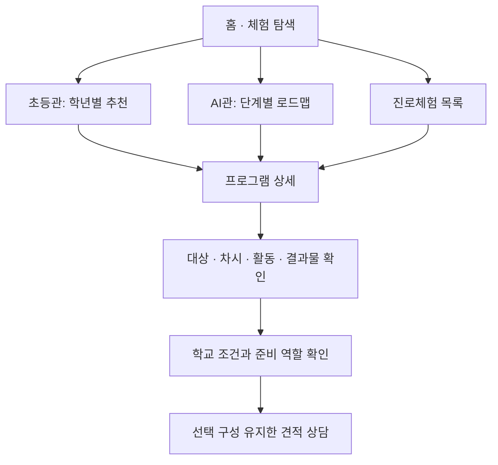

# 콜로소의 상세페이지 경험을 드림플렉스 수업 안내로 재설계

작성일: 2026-09-07 · 범위: 홈페이지와 상세 커리큘럼의 설계·첫 구현. 운영 배포 완료 문서가 아니다.

## 1. 목적과 사람

대표의 요청은 콜로소의 디자인을 충분히 구현하면서 드림플렉스에 맞는 상세 커리큘럼을 설계·계획할 수 있게 만드는 것이다. 저장소는 수강용 영상 플랫폼 복제에서 학교 방문형 체험 홈페이지로 바뀌고 있으나, 데이터와 일부 안내가 이전 형태에 남아 있다.

| 사람 | 알아야 하는 것 | 성공 행동 |
|---|---|---|
| 담당 선생님 | 대상 학년, 수업 내용, 차시, 결과물, 준비 부담, 비용 조건 | 적합한 구성을 선택하고 같은 정보로 상담 시작 |
| 학생 | 내가 하는 활동, 완성하는 것, 어려울 때 참여 방법 | 체험 장면을 이해하고 참여할 수 있다고 느끼기 |
| 운영 직원 | 원본 자료, 누락 내용, 실제 제공 조건, 검토 이력 | 확인된 내용으로 상세페이지와 안내 자료 갱신 |
| 강사 | 시간 배분, 교구, 진행 방식, 성취 확인, 예외 대응 | 다른 강사도 같은 기준으로 수업 운영 |
| 대표 | 프로그램별 완성도와 미결 사항, 판단 근거 | 과장된 완료율 없이 다음 작업 결정 |

## 2. 코드에서 확인한 원인

| 현행 증거 | 사업상 문제 | 처리 |
|---|---|---|
| `CurriculumLesson`에 제목·문자열 시간만 있음 | 상세한 수업 설계가 들어갈 자리가 없음 | 목표·학생 활동·분 단위 시간·산출물·평가·진행 안내로 확장 |
| 23개 중 15개가 같은 네 레슨 문구 사용 | 프로그램별 차이와 체험 장면을 설명하지 못함 | 개별 원본 수업으로 단계별 이전 |
| 알 수 없는 slug에 AI 리터러시 반환 | 다른 체험을 눌러도 AI 수업이 나옴 | 실제 프로그램만 조회, 없는 주소는 404 |
| 카테고리 카드에 미등록 별칭 15개 | 목록과 상세페이지가 연결되지 않음 | 대응 프로그램이 있는 13개 수정, 원본 없는 2개 비노출 |
| 모든 대표 이미지 경로의 파일 누락, `*.png` 무시 | 다른 컴퓨터·배포 환경에서 핵심 비주얼 없음 | public PNG 추적 허용, 자산 복구를 별도 완료 조건으로 관리 |
| 생성 스크립트에 `Math.random()` 실적 생성 | 근거 없는 숫자가 신뢰 자료처럼 보임 | 생성 제거, 근거가 있는 수치만 공개 표시 |
| AI 수업에 과학수사 후기 문구 포함 | 잘못된 프로그램의 후기 노출 | 원문 근거와 프로그램 연결을 갖춘 후기만 표시 |
| `RequiredTools`를 import하고 렌더하지 않음 | 학교가 준비 조건을 확인하지 못함 | 상세 수업안의 역할별 준비 안내, 기존 프로그램의 준비물 표시 |
| 모든 견적 링크가 `/ai-quote` | 읽던 프로그램과 선택 구성이 사라짐 | 프로그램·수업안 ID를 전달하고 요청사항에 표시 |
| API는 계산만 하지만 ‘접수’로 응답 | 실제 담당자에게 전달됐다고 오해 | 계산 완료 안내로 수정, 실접수는 다음 단계로 명시 |
| 과거 보고서에 92.4%, 디자인 100% 등 | 내용·자산·실운영의 누락이 가려짐 | 과거 평가 보존, 최신 목표 문서에서 적용 범위 설명 |

## 3. 콜로소에서 가져올 구조와 드림플렉스에서 바꿀 의미

참고: [콜로소 홈](https://coloso.co.kr/), [그래픽 디자인 클래스 상세](https://coloso.co.kr/products/100lecture-graphicdesignbasic). 2026-09-07 공개 페이지 텍스트와 섹션 구성을 확인했다. 화면 치수·색상·모션의 측정은 아직 하지 않았다.

참조 상세에서는 큰 대표 비주얼 뒤에 소개·연사·클래스 특징·커리큘럼·추천 탐색, 학습 로드맵, 결과물 예시, 세부 레슨과 별도 상세 자료를 연결한다. 아래는 이를 학교 담당자의 결정에 맞게 적용하는 설계다.

| 콜로소 요소 | 드림플렉스 적용 | 필수 내용 |
|---|---|---|
| 대표 비주얼과 강의 요약 | 실제 체험 사진·영상과 학교 수업 요약 | 프로그램명·대상·핵심 활동·기본 구성·상담 진입 |
| 클래스 특징 | 학생의 활동과 결과물 | 행동이 보이는 사진, 결과물 예시, 학습 목표 |
| 커리큘럼 로드맵 | 초등 학년별 추천 / AI 단계별 성장 | 적합한 대상과 다음 과정, 연결된 프로그램 ID |
| 파트·레슨의 깊이 | 차시·시간별 학생 활동 | 목표·행동·산출물·배움의 확인 기준 |
| 연사 소개·인터뷰 | 운영 강사진과 수업 방식 | 실제 경력 근거, 해당 수업 운영 역할 |
| 강의 수강 규정·필요 도구 | 학교 현장 준비·진행 조건 | 학교/업체 역할, 교실·기기·교구·대체 활동 |
| 수강 후기 | 해당 프로그램의 학교·학생 후기 | 원문, 학년, 프로그램, 공개 확인 기록 |
| 구매·하단 고정 요약 | 학교 맞춤 상담·견적 | 선택한 프로그램·차시·대상 유지 |

타사 로고·후기·실적·회사 정보는 드림플렉스의 근거 자료로 사용하지 않는다. 공개 참고 자료는 섹션 관계를 설계하는 근거로 사용한다.

## 4. 디자인 계약

전체 페이지의 방향은 **체험 사진이 중심인 큰 소개 영역 + 차분하게 읽는 상세 설명 + 번호로 이어지는 수업 과정**이다. 기존 Dreamplex 네이비·블루와 Pretendard를 유지한다.

| 항목 | 구현 기준 | 비교·완료 기준 |
|---|---|---|
| 첫 화면 | 프로그램을 구별하는 제목, 대표 활동, 대상·시간, 커리큘럼/견적 진입 | 선생님이 스크롤 전에 프로그램을 식별 |
| 폭·여백 | 기존 1120px 컨테이너, 넓은 섹션 간격, 한쪽으로 정렬된 본문 | 모바일 360/390px와 데스크톱 1440px에서 문장 잘림 없음 |
| 글자 | 상세 본문 16px 이상, 핵심 제목 32~44px, 정기적으로 읽는 보조 정보 14px 이상 | 확대 200%에서도 읽기·선택 가능 |
| 커리큘럼 | 2·4·6차시 등을 실제 작성된 옵션만 표시, 왼쪽 큰 번호와 오른쪽 활동 흐름 | 탭 변경 시 시간·결과물·하단 상담 선택이 일치 |
| 이미지 | 대표 16:9, 활동과 결과물은 내용에 맞는 비율, 실제 파일·설명·출처 | 깨진 이미지와 가상 현장 사진을 실적처럼 쓰는 경우 없음 |
| 상호작용 | 커리큘럼 선택, 상세 진행 안내 펼치기, 스크롤 위치 탐색, 하단 상담 | 키보드 선택·모바일 터치·감소 모션 설정 대응 |
| 고정 요소 | 헤더·탭·하단 상담 사이의 겹침 방지 | 마지막 활동과 버튼이 가려지지 않음 |

디자인 비교는 ‘비슷함 100%’ 같은 주관 점수로 완료 처리하지 않는다. 참조의 동일 섹션과 구현 화면을 같은 화면 폭으로 비교하고 차이를 `유지 / Dreamplex에 맞게 변경 / 미구현`으로 기록한다. 실제 현장 자산을 복구한 다음 이 검증을 수행한다.

## 5. 사용자 흐름과 화면 구조

상세페이지 순서: 대표 활동 → 프로그램 소개·기대 결과 → 수업 구성 선택 → 차시별 활동 → 학년별 조정 → 준비·예외 대응 → 강사진 → 확인된 후기 → 운영 안내 → 관련 프로그램. 현재 구현은 이 흐름 중 수업 설계와 선택 전달을 우선 완성했다.

메인과 전용관은 후속 구현이다. 실제 수업안이 없는 로드맵 단계나 준비되지 않은 프로그램에 가짜 상세페이지를 연결하지 않는다.

## 6. 한 번 작성한 내용이 연결되는 데이터 구조

현재: Git에 저장된 TypeScript 원본으로 운영하고, 구조화한 `CurriculumDesign`을 상세페이지가 직접 읽는다. 편집 DB나 AI 작성 서버는 현재 없다.

| 정보 | 원본 | 화면·산출물 | 변경 담당 및 확인 |
|---|---|---|---|
| 프로그램 식별·소개 | `products/{slug}.ts` | 홈 카드·상세·견적 프로그램명 | 운영팀 확인; 카드 원본 통합은 후속 |
| 수업안·기본 선택 | `curriculumPlans.ts` | 선택 버튼·학습 내용·하단 요약·견적 요청사항 | 강사·교육 담당 검토 |
| 차시·활동 시간 | `sessions[].activities[].minutes` | 합산 시간·상세 시간 배분·수업 문서 | 합계 검증 |
| 산출물·평가 | 수업안의 결과·평가 필드 | 상세페이지와 강사 진행안 | 목표와 활동의 일치 확인 |
| 학교/업체 준비·대체안 | 수업안 preparation | 준비 안내·상담 조건 | 운영 담당 확인 |
| 실적·후기 | 원본 데이터 + evidence | 근거가 있고 프로그램이 맞는 경우만 표시 | 실제 자료와 공개 범위 확인 |
| 미결·변경 이유 | openQuestions·source와 Git 기록 | 담당자 검토와 다음 작업 | 대표·교육 담당 |

`제안`은 새 수업 설계다. `확정` 표시는 검토 기록과 미결 항목 해소가 있어야 검증을 통과한다. 이 검증은 현재 테스트에 연결돼 있으며 저장·발행 관리자 화면을 구현한 것은 아니다.

향후 편집 화면을 만들 때의 구조: Program → CurriculumVersion → Session → Activity, 별도로 EvidenceAsset·Review·Revision을 연결한다. 확정 버전은 보존하고 수정하면 새 제안 버전을 만든다. 상담은 프로그램과 버전, 선택 구성을 함께 저장해야 나중에 홈페이지 내용이 바뀌어도 요청 당시 조건을 알 수 있다.

## 7. 상세 수업안 작성 규칙

1. 학년, 수업 길이, 기기·교구, 최종 결과물을 먼저 정한다.
2. 최종 결과물을 만들기 위해 필요한 활동을 역순으로 찾는다.
3. 각 차시에 목표·학생 행동·분 단위 시간·결과·확인 기준을 모두 적는다.
4. 2·4·6차시는 각각 끝맺음이 있는 별도 과정으로 작성한다. 긴 과정의 앞부분을 잘라 붙이지 않는다.
5. 1차시를 무조건 50분으로 보지 않는다. 실제 계약 수업 시간과 쉬는 시간을 별도로 정의한다.
6. 실제 자료에서 가져온 사실, 새 제안, 운영 확인이 필요한 내용을 구분한다.
7. 학년별 설명·역할·도움 수준과 기기/공간 문제의 대체안을 함께 작성한다.
8. 원문이 없는 강사 경력·인증·실적·후기는 생성하지 않는다.

예시 5개는 [상세 설계안](../../02-design/dreamplex-curriculum-blueprints.md)에 있다. AI 100·200·300분, 마술 120분, 바리스타 90분은 이번 제안 기준이며 모든 학교의 표준 시간표를 뜻하지 않는다.

## 8. 실행 순서와 완료 조건

| 순서 | 작업 | 이번 상태 | 완료 조건 |
|---|---|---|---|
| 1 | 목표·근거·오류와 최신 현황 정리 | 작성 완료 | 다음 작업자가 목적과 미결 내용을 바로 파악 |
| 2 | 수업안 구조·선택형 화면·견적 전달 | 첫 구현 완료 | 모든 제안의 시간·결과·준비 조건 일치 |
| 3 | AI·마술·바리스타 상세 설계 | 제안 5종 작성 | 담당자 확인과 실제 교구·계정·운영 시간 대조 |
| 4 | 대표 이미지·활동 사진·결과물 복구 | 자료 필요 | 23개 프로그램별 필요한 자산과 출처 확보 |
| 5 | 남은 20개 프로그램별 수업 설계 | 미진행 | 일반 문구 제거, 각 프로그램의 차시별 완결성 확인 |
| 6 | 초등관 추천·AI 로드맵과 목록/상세 원본 통합 | 설계 단계 | 모든 추천이 실제 상세와 연결, 학년·시간 불일치 없음 |
| 7 | 관리자 편집·검토·버전 이력 | 설계 단계 | 직원이 코드 없이 수정하고 확인된 버전을 배포 |
| 8 | 실제 상담 저장·발송·가격표 연결 | 미진행 | 요청 ID·처리 상태·담당자 확인·재시도·단가 근거 |
| 9 | 실제 이미지로 디자인·모바일 사용 검증 | 미실시 | 기준 폭 비교, 버튼·탭·사진·문의 흐름 통과 |

기간을 임의 확정하지 않는다. 사진·강사 확인 자료를 확보하면서 3~5번을 프로그램 단위로 완성하고, 완성된 콘텐츠로 6번을 연결한다.

## 9. 기존 15개 과제의 연결

| 기존 번호·목적 | 이번 설계에서의 위치 | 먼저 필요한 것 |
|---|---|---|
| 1 상세페이지 사진·문서 | 구조화 수업안과 실제 자산 | 수업 원본·대표/활동/결과물 사진 |
| 2 초등/중등 후기 | 프로그램·학년·근거 연결 | 실제 후기 원문 |
| 3 즉시 견적·쉬운 사용 | 선택 전달 → 가격표 → 실접수 | 단가·최소 인원·부가세 등 기준 |
| 4 각 커리큘럼 영상 | 대표/활동 섹션의 미디어 | 승인된 수업안과 촬영본 |
| 5 초등관 학년 추천 | 학년별 적합 이유·다른 참여 방식 | 학년별 수업안 |
| 6 AI 로드맵·상세 | 비교 → 설계 → 제작 → 검증 → 발표 | 이번 AI 설계 검토·각 단계 프로그램 연결 |
| 7 게시판·홍보 | 후속 소식·현장 자료 연결 | 글 작성 주체·노출 기준 |
| 8 체험모험ZIP | 직업별 미션·체험 장면 강조 | 드론·CSI 실제 활동 시나리오 |
| 9 스튜디오 컨셉 메인 | 대표 비주얼과 프로그램 탐색 | 브랜드 이미지 방향·사진 |
| 10 드림팀·회사 소개 | 실제 강사진·운영 원칙 | 회사 사실·경력 자료 |
| 11 AI관 소개 영상 | 로드맵 위 소개 | 확정된 AI관 구조 |
| 12 초등관 진행 안내 영상 | 교사 준비·학생 참여 흐름 | 운영 절차 확정 |
| 13 대표 사진 소싱 | 자산 관리·업로드 기준 | 현장 원본 확보·사용 범위 |
| 14 자체 사이트 홍보 영상 | 해당 수업 산출물과 연결 | 실제 사이트 목록·시연 |
| 15 학교 블로그 누적 | 실제 운영 사례와 프로그램 연결 | 학교별 사진·활동 기록 |

## 10. 출시와 다음 수정의 기준

‘디자인이 그럴듯함’과 ‘프로그램이 실제 운영 가능함’을 각각 검증한다. 대표 사진 누락, 타사 연락처·회사 정보, 근거 없는 경력, 일반형 커리큘럼이 남아 있는 페이지는 실제 운영 준비가 끝난 것으로 표시하지 않는다. 이 브랜치는 검토용이며 자동 배포·자동 병합을 요청하지 않는다.

다음 수정은 `PROJECT.md` → 이 계획 → 해당 프로그램 원본 → 미결 사항 순으로 읽는다. 기능을 추가했다는 기록보다, 어떤 사람이 무엇을 할 수 있게 되었는지와 아직 못 하는 것을 함께 남긴다.
